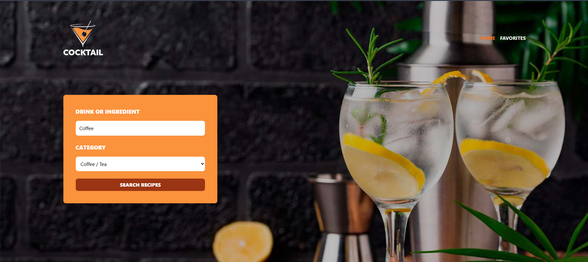
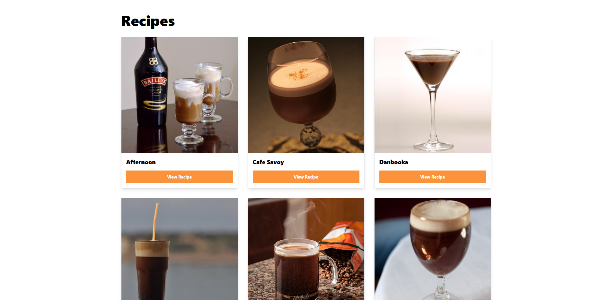
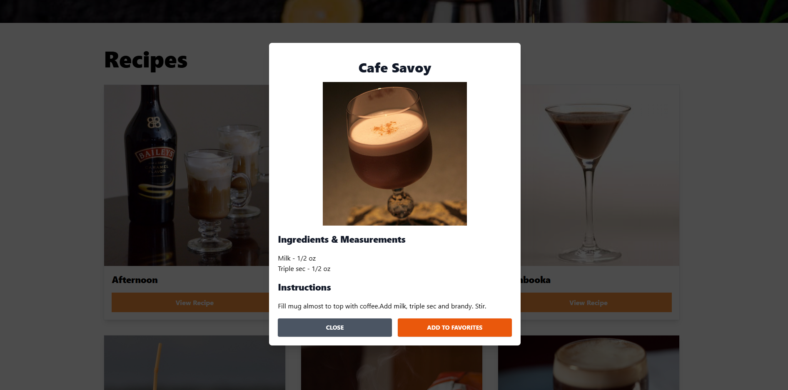
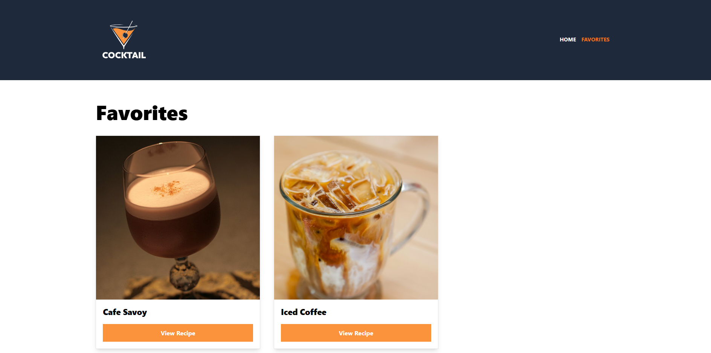

# 🍸 MixologyMate

**Live Site:**
[https://mixologymate.netlify.app](https://mixologymate.netlify.app)

MixologyMate is a sleek, responsive cocktail recipe app built with React,
TypeScript, Zustand, TailwindCSS, and React Router. Users can search for drinks
by ingredient and category, view recipes in a modal, and save their favorites to
local storage. Designed to be a stylish and practical portfolio project for
aspiring front-end developers.

---

## 📸 Screenshots

 
 

---

## 🚀 Tech Stack

- **React** with **TypeScript**
- **Zustand** for global state management
- **TailwindCSS** for fast and responsive UI
- **React Router DOM** for routing
- **Vite** for blazing fast dev environment
- **TheCocktailDB API** as data source

---

## 🎯 Features

- 🔎 Filter cocktails by **ingredient** and **category**
- 📄 View detailed **instructions** and **measurements**
- 💾 Save your favorite recipes in **local storage**
- ✨ Fully responsive layout, clean animations and transitions
- ⚠️ Toast-style **notifications** for UX feedback

---

## 🧠 What I Learned

This project strengthened my skills in:

- Building scalable components with **TypeScript**
- Using **Zustand slices** to modularize app logic
- Creating responsive designs with **Tailwind**
- Handling API calls and **schema validation** with **Zod**
- Implementing lazy-loaded routes with **React Router**

---

## 🛠️ Getting Started

```bash
# Clone the repository
git clone https://github.com/guillevarelabarros/mixologymate.git
cd mixologymate

# Install dependencies
yarn install

# Start development server
yarn dev
```

---

## 📁 Folder Structure

- `src/components` – Reusable UI components
- `src/views` – Pages (Home, Favorites)
- `src/stores` – Zustand slices
- `src/services` – API logic
- `src/types` – Type definitions using Zod
- `src/utils` – Zod schemas
- `public/` – Static assets (screenshots, logo, bg)

---

## 📬 Contact

If you’d like to get in touch, feel free to connect via
[LinkedIn](https://www.linkedin.com/in/guillevarelabarros) or reach me through
GitHub.

---

## ⭐️ Why this project?

This project was built with the goal of demonstrating my ability to:

- Build real-world UIs with modern technologies
- Write clean and typed code
- Structure apps with maintainability in mind

Thanks for checking it out!
